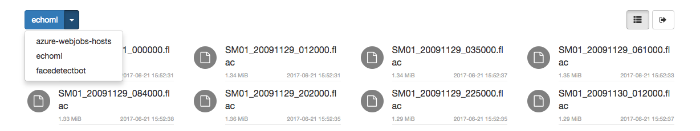
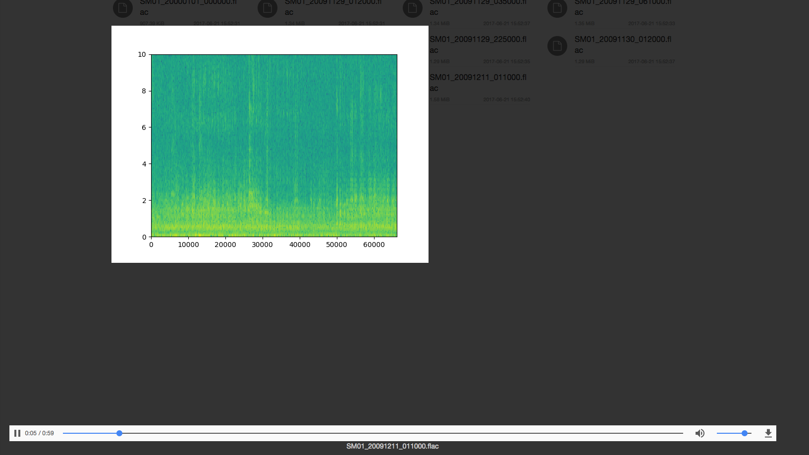

# EchoML

Play, visualize, and annotate your audio files

## Demo

[Demo Site](http://echoml.azurewebsites.net/)

## Screenshot





## Supported storage providers

- Azure blob storage
- AWS S3 (coming)

## Run

### Set variables

- Provide configurations for `storage` where you are storing the audio files
- Provide databae connection information to your mongo database instance where you are storing the labels for each audio file

#### Sample config file

config/development.json or config/production.json

```json
{
  "auth": {
    "keys": ["some secret"],
    "account": "test",
    "password": "test"
  },
  "storage": {
    "STORAGE_TYPE": "azureblob",
    "STORAGE_ACCOUNT": "",
    "STORAGE_ACCESS_KEY": ""
  },
  "mongo":{
    "url": "mongodb://localhost:27017/echoml"
  },
  "prediction": {
    "endpoint": "http://localhost/predict"
  }
}
```

#### Prediction Service (In-Development)

EchoML provides the the ability to integrate with external endpoints to load audio predictions/labels.

To do so:

- add a `predictions.endpoint`  configuation (as seen in sample config) to your config file and modify the `downloadPredictions()` function in `api.ts`

The existing code in `api.ts` expects your endpoint to respond to `POST` requests with a payload of:

| Param | ValueType | Description |
|---|---|---|
| file | File | File to be predicted against |
| t1 | number | Start time of which to analyze |
| t2 | number | End time of which to analyze |

Note: this feature is still heavily in development. Refer to the `downloadPredictions()` function in `api.ts` for a reference of how it works.

### Install GraphicsMagick

MacOS

```bash
brew install graphicsmagick
```

### Development

Start back-end node server.

```bash
npm run dev-back
```

Start webpack dev server to serve webpack bundle.

```bash
npm run dev-front
```

Open your browser and connect to http://localhost:5001.

### Production

Build bundle.

```bash
npm run build
```

Start server.

```bash
npm start
```

Open your browser and connect to http://localhost.

### Run with Docker

To update the code and rebuild the image:

Build bundle

```bash
npm run build
```

Build the docker image

```bash
docker build -t echoml .
```

To run the image, either pull my image from docker hub or use your own.

Run the docker image

```bash
docker run -p 80:80 -it ritazh/echoml:latest
```

## Acknowledgement

Leverage the awesome [waveform-playlist](https://www.npmjs.com/package/waveform-playlist) module created by @naomiaro.

## License

[MIT License](http://doge.mit-license.org)
