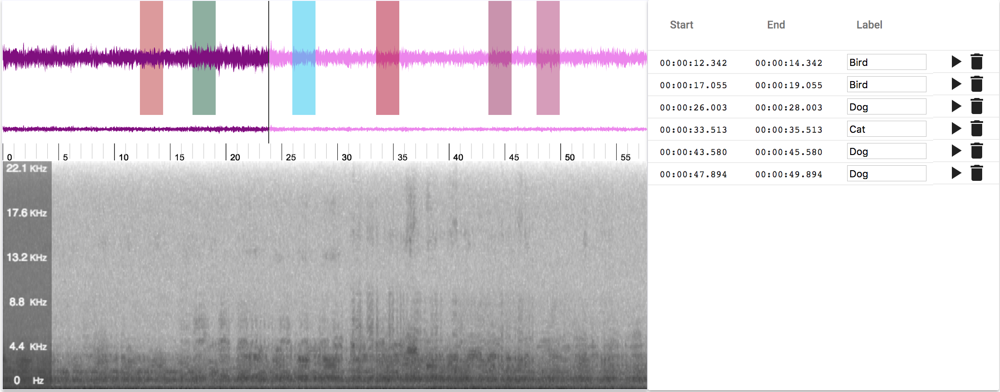

# EchoML

Play, visualize, and annotate your audio files

## Demo

[Demo Site](http://echoml.azurewebsites.net/)

## Screenshot




## Supported storage providers

* Azure blob storage

## Run

### Set variables

#### Required Environment Variables

The following variables are REQURED and can be either set in one of the config json files or in your environment

| Variable            | Type   | Description                                                                                                                             |
| ------------------- | ------ | --------------------------------------------------------------------------------------------------------------------------------------- |
| HOSTNAME            | string | The hostname for `http.createServer` to listen on                                                                                       |
| PORT                | string | The port for `http.createServer` to listen on; must be 4000 when in dev so local port forwarding works                                  |
| AUTH_KEY            | string | Random string which will be used to hash your user sessions                                                                             |
| MONGO_HOST          | string | Host of your MongoDB database; usually in `mongodb://your.host.name:port/collection` format; note username and password not passed here |
| MONGO_USERNAME      | string | MongoDB Username                                                                                                                        |
| MONGO_PASSWORD      | string | MongoDB Password                                                                                                                        |
| STORAGE_ACCOUNT     | string | Azure storage account name                                                                                                              |
| STORAGTE_ACCESS_KEY | string | Azure storage access key                                                                                                                |

#### Optional Configs

These variables are optional and can be set in one of the config json files

| Variable | type    | Description                                                        |
| -------- | ------- | ------------------------------------------------------------------ |
| cors     | boolean | If true, cors is enabled to allow different clients to ping server |
| log      | object  | Settings for the logger; refer to the default setup for example    |

### Development

To start both back and front ends in one command:

```bash
npm run dev
```

Or you can start both indvidually if you want some quieter logs

Start back-end node server.

```bash
npm run server
```

Start the frontend dev server with

```bash
npm run start
```

Open your browser and connect to http://localhost:3000.

### Production

Build bundle.

```bash
npm run build
```

Start server.

```bash
npm run prod
```

Open your browser and connect to http://localhost.

### Run with Docker

To update the code and rebuild the image:

Build the docker image

```bash
docker build -t echoml .
```

To run the image, either pull my image from docker hub or use your own.

Run the docker image

```bash
docker run -p 80:80 -it ritazh/echoml:latest
```

## Acknowledgement

Leverage the awesome [waveform.js](https://github.com/katspaugh/wavesurfer.js)

## License

[MIT License](http://doge.mit-license.org)
